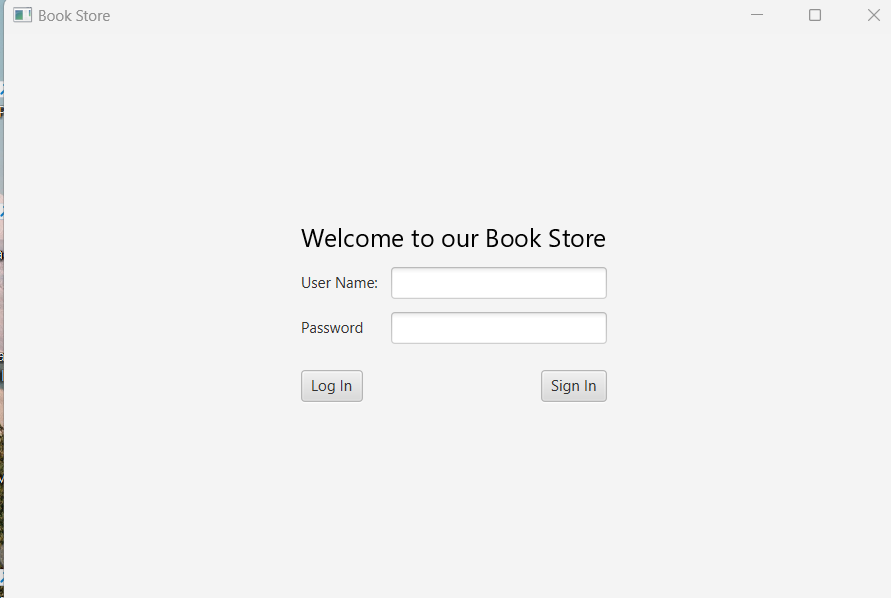
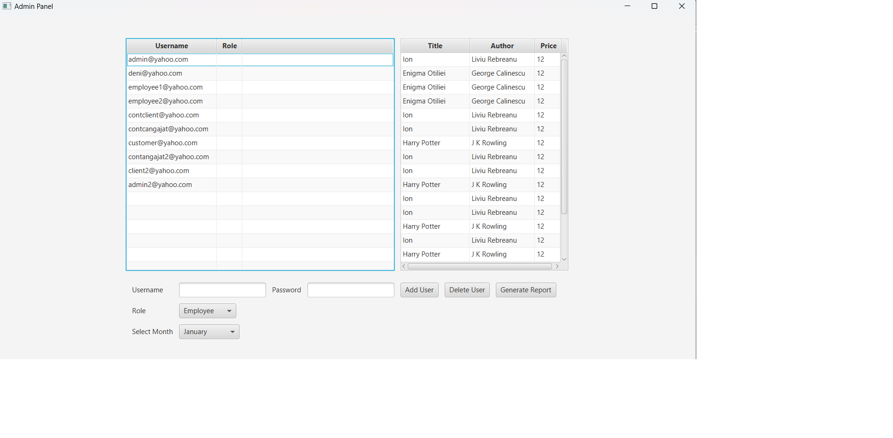
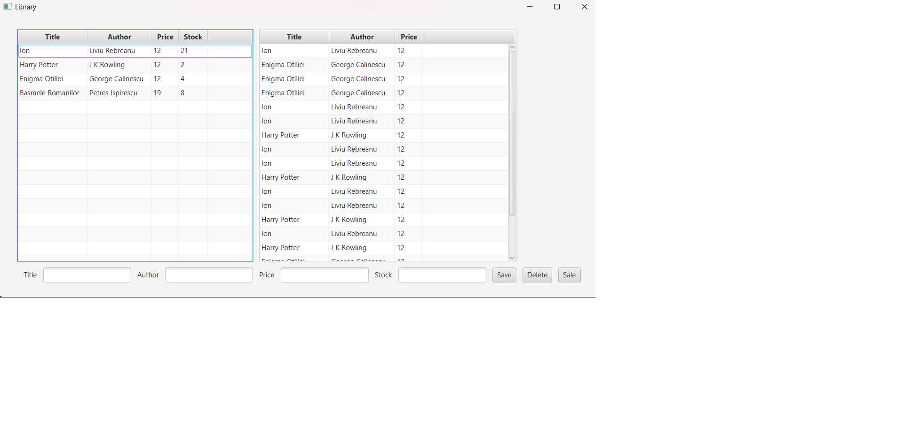

# 📚 Virtual Library Application

## Description

This application is a virtual library that allows the management of books and users. The application is connected to a database for storing and managing information.

## Main Features

- **User authentication** (Admin and Employee)
- **Book management** (add, edit, delete, search)
- **User management** (add, edit, delete - Admin only)
- **Report generation**
- **Role-based access control**

## 📌 Application Interface

###  Login Page
Users must authenticate to access the application.

###  Admin Interface

The administrator can manage users and the books available in the library.

- ✅ **Add users** (employees and customers)
- ✅ **Delete users**
- ✅ **View and manage books**
- ✅ **Generate reports** by month

###  Employee Interface

Employees have access to a simplified interface for book management.

- ✅ **Add books**
- ✅ **Delete books**
- ✅ **Sell books to customers**
